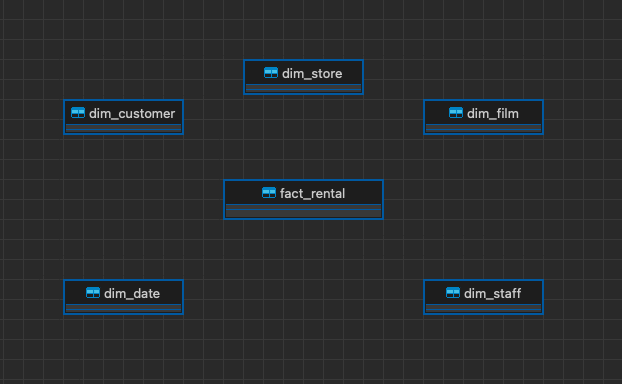

# dbt-project
The idea of this project is to create a database with tables in a star schema using DBT. 

The star schema is a database design that includes a fact table and dimension tables.

## Project overview
It is based on the Sakila database:

Which will turn into this dwh database:

### Components
To work with this project you need to install the following programs:
- [Docker](https://www.docker.com/products/docker-desktop/)
- [dbt](https://docs.getdbt.com/docs/core/installation)
- [DBeaver](https://dbeaver.io/download/) or similar tool

## Run the project
- Clone this repo:
  
  `git clone https://github.com/mbvyn/dbt-project.git`
- Download and run db with the command:

  `docker run -e POSTGRES_PASSWORD=sakila -p 5432:5432 -d frantiseks/postgres-sakila`
- Connect to the database:
  - **host**: localhost:5432
  - **database/username**: postgres
  - **password**: sakila

- Run dbt project:
  - `dbt run`

### Resources:
- Learn more about dbt [in the docs](https://docs.getdbt.com/docs/introduction)
- Check out [Discourse](https://discourse.getdbt.com/) for commonly asked questions and answers
- Join the [chat](https://community.getdbt.com/) on Slack for live discussions and support
- Find [dbt events](https://events.getdbt.com) near you
- Check out [the blog](https://blog.getdbt.com/) for the latest news on dbt's development and best practices
